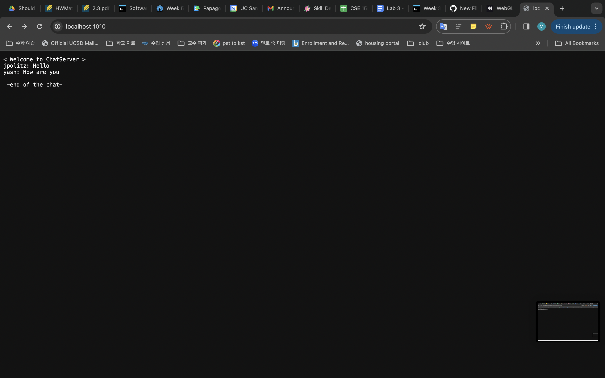
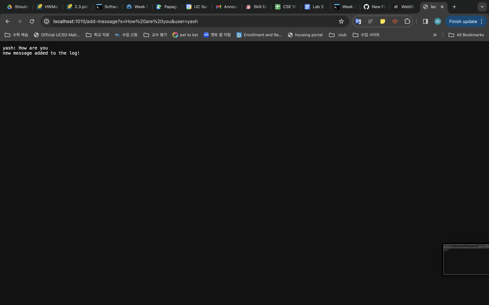

<h1> Part 1</h1>
<h2> ChatServer.java code</h2>
  
```
import java.io.IOException;
import java.net.URI;
import java.util.*;

class Handler implements URLHandler {
    ArrayList<String[]> chat_log = new ArrayList<>();

    public String handleRequest(URI url) {
        String message="";
        if (url.getPath().equals("/")) { message+="< Welcome to ChatServer > \n"; 
            for(String[] log:chat_log){ message+=log[0]+": "+log[1]+"\n";           }

            message+="\n -end of the chat-";

            return message;
        }

        ///url: add-message?s=<string>&user=<string>
        else {
            if(url.getPath().contains("/add-message")) {
                String[] queries = url.getQuery().split("&"); // split actual message part & user part

                String[] s_command=queries[0].split("=");
                String[] user_command=queries[1].split("=");
                if(s_command.length<2||user_command.length<2){ // when user didn't input any user or message
                    return "unvalid command";
                }

                if(s_command[0].equals("s")&&user_command[0].equals("user")){
                    chat_log.add(new String[]{user_command[1],s_command[1]});
                }

                return user_command[1]+": "+s_command[1]+"\n"+"new message added to the log!";
            }

        }
            return "404 Not Found!";
    }
}


class ChatServer {
    public static void main(String[] args) throws IOException {
        if(args.length == 0){
            System.out.println("Missing port number! Try any number between 1024 to 49151");
            return;
        }

        int port = Integer.parseInt(args[0]);

        Server.start(port, new Handler());
    }
}

```

<h2>Screenshots</h2>
  
  <p>
    <ol>
      <li> Which methods in your code are called?
      <br> >handleRequest is called</li>
      <li> What are the relevant arguments to those methods, and the values of any relevant fields of the class?
      <br> > </li>
      <li> How do the values of any relevant fields of the class change from this specific request? If no values got changed, explain why.
      <br> > </li>
  
