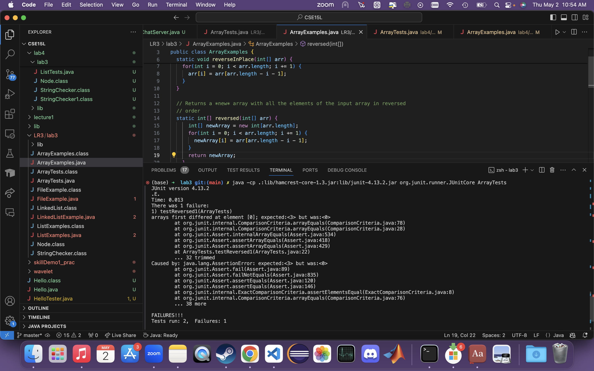
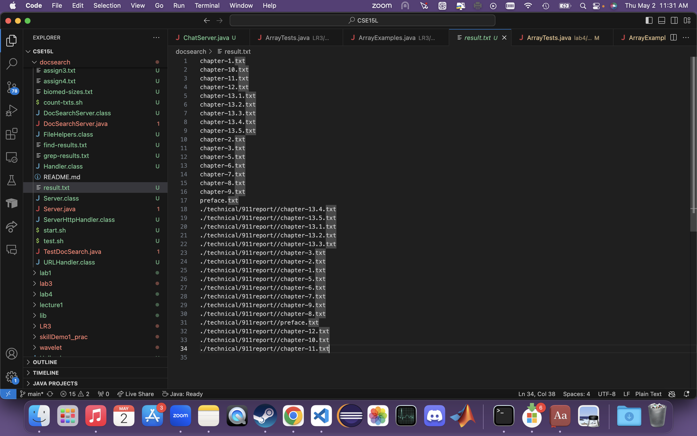
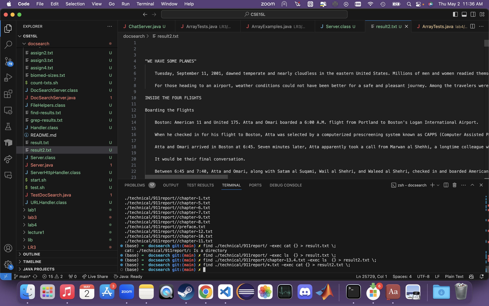

# Week 5 Lab Report
## Part 1: Bugs from week 4
<ol>
  <li> A failure-inducing input for the buggy program, as a JUnit test and any associated code</li>
  
```
@Test 
public void testReverseInPlace1() {
	int[] input1 = { 1,2,3 };
	ArrayExamples.reverseInPlace(input1);
	assertArrayEquals(new int[]{ 3,2,1 }, input1);
}
```

  <li> An input that doesn't induce a failure, as a JUnit test and any associated code</li>
    
```
@Test 
public void testReverseInPlace2() {
	int[] input1 = { 3 };
	ArrayExamples.reverseInPlace(input1);
	assertArrayEquals(new int[]{ 3 }, input1);
}
```
  
  <li> The symptom, as the output of running the two tests above.</li>
  
  

  <li> The bug, as the before-and-after code change required to fix it.
  <br> Before:

```
    
static int[] reversed(int[] arr) {
	int[] newArray = new int[arr.length];
	for(int i = 0; i < arr.length; i += 1) {
		arr[i] = newArray[arr.length - i - 1];
	}
	return arr;
}
      
```

  <br> If this method is executed, elements in <code>newArray[arr.length - i - 1]</code> is applied to the <code>arr[i]</code>. Therefore, all elements in <code>arr</code> becomes null not being reversed.

  <br> After:

```
    
static int[] reversed(int[] arr) {
	int[] newArray = new int[arr.length];
	for(int i = 0; i < arr.length; i += 1) {
		// fixed section 1
		newArray[i] = arr[arr.length - i - 1];
	}
	// fixed section 2
	return newArray;
}
      
```
    
  </li>
    
  <li> Briefly describe (2-3 sentences) why the fix addresses the issue
  <br> > section 1: Now the element in <code>arr[arr.length - i - 1]</code> is applied to the <code>newArray[i] </code>, therefore <code>newArray</code> becomes the reversed array of <code>arr</code>.
  <br> > section 2: Now the method returns <code>newArray</code> properly reversed new array is returned now.
  </li>
    
</ol>


## Part 2: Researching Commands
### find
The command is used to find a directory or a file.
<br>4 interesting command-line options or alternate ways to use the single command you chose. 
  <ol>
  <li> <code> -empty </code>: finding files that are empty or its size is 0. </li>
    <br> example:
    
```
(base) ➜  docsearch git:(main) ✗ find ./technical/911report/ -empty
(base) ➜  docsearch git:(main) ✗ find ./technical/911report/chapter-1.txt -empty
```
  > Since <code>911report</code> doesn't have an empty file, nothing is printed.
  <br>> Since <code>chapter-1.txt</code> isn't an empty file, nothing is printed.
      
  <li> <code> -exec </code>: execute the inputted command that is written after the option. </li>
    <br> example:
      
```
(base) ➜  docsearch git:(main) ✗ find ./technical/911report/ -exec ls  {} > result.txt \;
(base) ➜  docsearch git:(main) ✗ find ./technical/911report/*.txt -exec cat {} > result2.txt \;
```
  
    
      
  > The command line executes <code>ls</code> command, using the result of <code>find ./technical/911report/</code> as argument and saves it in the new file <code>result.txt</code>.
  <br>> The command line executes <code>cat</code> command, using the result of <code>find ./technical/911report/*.txt</code> as argument and saves it in the new file <code>result2.txt</code>.
  
  <li> <code> -type </code>: finding files which matches with the inputted type. </li>
  <br> example:
      
  ```
(base) ➜  docsearch git:(main) ✗ find ./technical/911report/ -type f   
./technical/911report//chapter-13.4.txt
./technical/911report//chapter-13.5.txt
./technical/911report//chapter-13.1.txt
./technical/911report//chapter-13.2.txt
./technical/911report//chapter-13.3.txt
./technical/911report//chapter-3.txt
./technical/911report//chapter-2.txt
./technical/911report//chapter-1.txt
./technical/911report//chapter-5.txt
./technical/911report//chapter-6.txt
./technical/911report//chapter-7.txt
./technical/911report//chapter-9.txt
./technical/911report//chapter-8.txt
./technical/911report//preface.txt
./technical/911report//chapter-12.txt
./technical/911report//chapter-10.txt
./technical/911report//chapter-11.txt
(base) ➜  docsearch git:(main) ✗ find ./technical/911report/ -type d
./technical/911report/
(base) ➜  docsearch git:(main) ✗ find ./technical/911report/chapter-11.txt  -type f
./technical/911report/chapter-11.txt
(base) ➜  docsearch git:(main) ✗ find ./technical/911report/chapter-11.txt  -type d
```
      
  > Executing the first command line, only file paths are printed, executing the directory path.
  <br>> Executing the second command line, only the directory path is printed, executing all file paths.
  <br>> Executing the third command line, since the argument is a file path, the argument is printed.
  <br>> Executing the fourth command line, since the argument is not a directory path, the argument isn't printed.
  
  <li> <code> -print0 </code>: print the found file in the terminal. The result is separated by 'null'</li>
  <br> example:
    
```
(base) ➜  docsearch git:(main) ✗ find ./technical/911report/ -print0                
./technical/911report/./technical/911report//chapter-13.4.txt./technical/911report//chapter-13.5.txt./technical/911report//chapter-13.1.txt./technical/911report//chapter-13.2.txt./technical/911report//chapter-13.3.txt./technical/911report//chapter-3.txt./technical/911report//chapter-2.txt./technical/911report//chapter-1.txt./technical/911report//chapter-5.txt./technical/911report//chapter-6.txt./technical/911report//chapter-7.txt./technical/911report//chapter-9.txt./technical/911report//chapter-8.txt./technical/911report//preface.txt./technical/911report//chapter-12.txt./technical/911report//chapter-10.txt./technical/911report//chapter-11.txt%                                                                                                   
(base) ➜  docsearch git:(main) ✗ find ./technical/911report/chapter-11.txt -print0
./technical/911report/chapter-11.txt%
```

  > Executing the first command, all directories and files in the inputted path are printed on one line without being separated.
  <br>> Executing the second command, the file path is printed.
                                                                                                 
  </ol>
Found the information by browsing on the internet (<a href="https://recipes4dev.tistory.com/156">link</a>).
