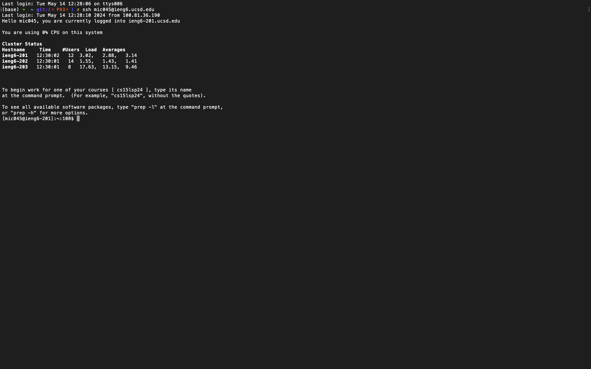

# Step 4
Log into ieng6

     1. type <code>ssh (up arrow)</code> to login
     Key pressed: &#60;up&#62;&#60;Enter&#62;

# Step 5
Clone your fork of the repository from your Github account (using the SSH URL)

     1. type <code>git clone (ctrl+C)</code> to clone the repository, then press <code>Enter</code>
     Key pressed: &#60;Enter&#62;

# Step 6
Run the tests, demonstrating that they fail

     1. type <code>ls</code> to check the folder name, then press <code>Enter</code>
     2. type <code>cd lab7</code> to change the working directory, then press <code>Enter</code>
     3. type <code>ls</code> to check the files in the folder name, then press <code>Enter</code>
     4. type <code>bash test.sh</code> to execute the test, then press <code>Enter</code>
     Key pressed: &#60;Enter&#62;,&#60;Enter&#62;,&#60;Enter&#62;,&#60;Enter&#62;

# Step 7
Edit the code file to fix the failing test

     1. type <code>vim </code>, double click <code>ListExamples.java</code> to copy the name of the java tester, then press <code>Ctrl+C</code> after the <code>vim </code>, then click <code>Enter</code>
     2. press <code>j</code> 30 times and <code>l</code> five times to go to the part I have to change, locate cursor on <code>1</code>
     3. press <code>r2</code> to replace 1 to 2, so the code will now increment <code>index2</code> not <code>index1</code>
     4. press <code>:wq</code> to save change and exit the file, then press <code>Enter</code>
     Key pressed: <Ctrl+C>&#60;Enter&#62;, &#60;up&#62;&#60;up&#62;&#60;up&#62;&#60;up&#62;&#60;up&#62;&#60;up&#62;&#60;up&#62;&#60;up&#62;&#60;up&#62;&#60;up&#62;&#60;up&#62;&#60;up&#62;&#60;up&#62;&#60;up&#62;&#60;up&#62;&#60;up&#62;&#60;up&#62;&#60;up&#62;&#60;up&#62;&#60;up&#62;&#60;up&#62;&#60;up&#62;&#60;up&#62;&#60;up&#62;&#60;up&#62;&#60;up&#62;&#60;up&#62;&#60;up&#62;&#60;up&#62;&#60;up&#62;&#60;up&#62;&#60;up&#62;&#60;up&#62;&#60;up&#62;&#60;up&#62;&#60;up&#62;, &#60;up&#62;, &#60;Enter&#62;

# Step 8
Run the tests, demonstrating that they now succeed

     1. press uparrow four times so that the command line types <code>bash test.sh</code> to automatically, then click <code>Enter</code>
     Key pressed: &#60;up&#62;&#60;up&#62;&#60;up&#62;&#60;up&#62;&#60;Enter&#62;

# Step 9
Commit and push the resulting change to your Github account (you can pick any commit message!)

     1. type <code>git add .</code> to add changes of all files, then press <code>Enter</code>
     2. type <code>git commit -m "Fix error in ListExamples.java"</code> to commit change on the local repository, then press <code>Enter</code>
     3. type <code>git push</code> to commit change on the remote repository, then press <code>Enter</code>
     Key pressed: &#60;Enter&#62;, &#60;Enter&#62;, &#60;Enter&#62;

